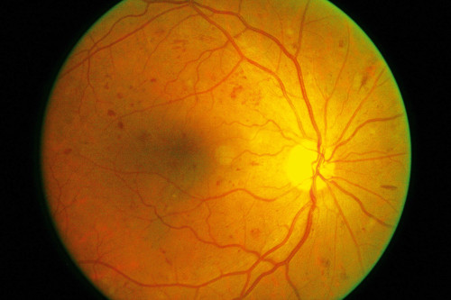
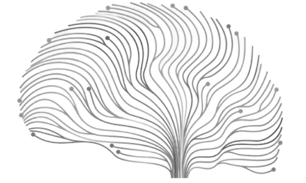

# Diabetic Retinopathy

The project aims to develop a standardized benchmarking of artificial intelligence for Opthalmology.The specific conditions and diseases include Diabetic Retinopathy (DR), Age-related Macular Degeneration (AMD), Glaucoma (GC), Pathological Myopia (PM) and Red Eye (RE).This benchmark is meant to test your ML model developed for the Ophthalmology use case.

Participate in this benchmark [here](https://health.aiaudit.org/web/challenges/challenge-page/164/overview).

# Multiple Psychiatric Developmental Diagnosis

The overarching goal of this challenge is to derive accurate predictions of the existence of one or more psychiatric conditions in the presence of multimorbidities. As diagnoses are not mutually exclusive, this constitutes a multi-task multi-label classification problem, where several related binary classification rules need to be derived from the same data.

Participate in this benchmark [here](https://health.aiaudit.org/web/challenges/challenge-page/337/overview).
