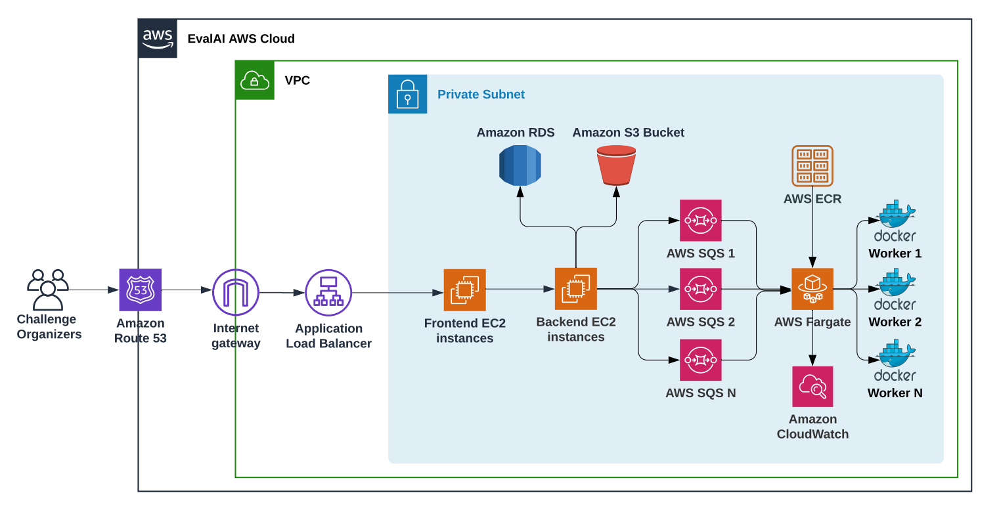

# Developer Guide

## 1. Background and Goals

The evaluation platform is part of a larger project to develop an ML assessment platform. The platform is developed by FG-AI4H and consists of multiple work streams namely, data storage, data cataloging, reporting, annotation, and our core package.

The platform is based on the open-source project EvalAi by CloudCV. EvalAI offers ML benchmarking in the form of challenges, offered by organizations for everyone to participate. Our goal is to adapt EvalAI’s technology and provide a model evaluation platform to be integrated into a larger project.

## 2. Project Overview

### Structure

```
├── apps                                                      #Django applications   
│   ├── challenges                                            #Handles creating, modifying and deleting challenges
│   ├── hosts                                                 #Functionalities for challenge hosts
│   ├── participants                                          #Functionalities for challenge participants
│   ├── jobs                                                  #Handles processing and evaluating submission
│   ├── web
│   ├── accounts
│   └── base
├── docker                                                    #Contains Dockerfiles, environment variables and settings
│   ├── dev
│   └── prod
├── frontend                                                 
│   └── src
│       ├── css
│       ├── fonts
│       ├── js                                                #Important for Angular Controllers and hosting settings
│       └── views
├── scripts                                                   #Scripts provided by EvalAi that make your life easier
│   ├── deployment
│       ├── deploy
│       └── push
│   ├── migration
│   ├── tools
│   └── workers                                               #Contains important code for the submission/code_upload workers
├── settings                                                  #Backend settings for the entire project, depending on environment
│   ├── common.py
│   ├── dev.py
│   ├── prod.py
│   └── test.py
├── docker-compose-production.yml                             #Necessary for starting production environment
├── manage.py                                                 #Very important Django tool; allows admin access, DB migration etc.
```
- **Apps** - contains all important Django applications. Referenced here are controllers, database structures as well as access points. When in doubt, familiarize yourself with Django’s setup.

- **Docker** - contains Docker and environment files with all important variables and configurations. These containers are called using the appropriate docker-compose.yml file with docker-compose. These are the project’s docker containers:
    - **Django**: Backend
    - **NodeJs**: Frontend
    - **Celery**: Queuing service for submissions
    - **Worker**: Submission worker which forwards them to the evaluation closer in ECS
    - **Code-Upload-Worker**: Worker specifically for Docker-based challenges.

- **Frontend** - This folder contains the frontend (HTML, CSS, fonts, images, etc.) It is Angular-based, but also uses Django’s template language. It is important to highlight that the frontend also contains a lot of the business logic, so be mindful when you adapt it. Static and Media content is stored in S3 in AWS.

- **Scripts** -  Scripts provided by EvalAI to make your life easier (deploy to AWS, evaluation worker scripts).

- **Settings** - Django Settings for the entire project, also depends on what environment you are using (development, staging or production).

### Architecture

In general, we have our frontend (nodeJS) and our backend (Django) hosted as scalable Docker instances on AWS. Django additionally communicates with our RDS database and an S3 bucket. When a client makes a request it gets processed by a load balancer and forwarded to our backend. The SQS queue registers a new task, such as executing an evaluation and spawns a worker environment, in which the evaluation is performed.

The platform is fully hosted on AWS. Mainly the following services are used:
 - **EC2**: Our compute instances that host the platform.
 - **RDS**: Out databases.
 - **S3**: Our static storage. Mainly used for frontend resources such as images, fonts etc. Our platform secrets are also stored there.
 - **IAM**: Access and permission configurations.
 - **ECS**: This is where our evaluation cluster is managed from. Handles individual tasks for every individual challenge.
 - **CloudWatch**: Our error logs are processed here.

### Our Deployment
We are currently working with two instances of our platform, one [staging](https://staging.health.aiaudit.org/) and one [production](https://health.aiaudit.org/). To work on both you need access to AWS, including the admin permission set. Once granted, it is best to use the AWS developer environment called Cloud9, which provides easy access to the instances.

As mentioned previously, the project is deployed as a docker cluster on the AWS instances. This is not optimal, as there is no fault-tolerance or resource management. As a long-term goal, we plan to migrate to using a Kubernetes cluster on AWS instead which will then manage the platform.

## 3. How does X work?

### Starting the project
Sometimes the docker containers running on our EC2 instances receive a timeout error. Unfortunately, this causes the entire website to go down. If this is the case, go to the respective instance and check the status of the containers.
```bash
docker ps
```
If no containers appear, they need to be re-started with the following command. Type is either *production* or *staging*.
```bash
sudo docker-compose -f docker-compose-TYPE.yml up
```

### Apply changes
Simply changing the code on the instance does not suffice. The reason for this is, that our platform is spawned from the docker containers, which are isolated from the instance itself. Instead, you need to re-build the respective docker containers, such that they pull the new code from the instance.

If you want to re-build the entire project, use:
```bash
sudo docker-compose -f docker-compose-TYPE.yml build
```
If you just want to re-build a single or a subset of services use:
```bash
sudo docker-compose -f docker-compose-TYPE.yml <SERVICENAME>
```
Occasionally, re-building the project won't work because Docker uses up a lot of disk space. In this case, you should delete old images and containers with the following command:
```bash
sudo docker system prune -a
```

### Migrate from staging to production
The staging instance is used to develop novel features, but once finished, we want to migrate them to our production instance. To do this we need to merge our features from our staging to our master branch on GitHub. Due to security issues, this repository is still private, but all developers will be given access. You should perform the following steps when merging:

1. **Testing**: Ensure that the new features are well tested before attempting to merge.
2. **Commit to Staging**: Commit your local changes on the staging instance to the **remote** staging branch. You can view the remote staging branch using this command:
```bash
remote -v
```
Push using this command:
```bash
git push origin staging:staging
```
It's also very helpful to have a look at the files that differ between the local and remote staging branch
```bash
git diff --name-only origin/YourBranch YourBranch
```
>[!ATTENTION]
 >Lastly it is VERY important to NEVER commit the .env files in the Docker folder or the ssl folder.

3. **Merge Pull Request**:
This is the tricky part of the migration process that frequently causes errors. Firstly, it can be very helpful to merge using the GitHub user interface, here [a detailed guide](https://docs.github.com/en/pull-requests/collaborating-with-pull-requests/incorporating-changes-from-a-pull-request/merging-a-pull-request).
You should merge staging into master, but **keep** the staging branch after the merge is completed. You will likely run into merge errors where you need to manually decide which code to keep. Generally, this fully depends on which file you're working on. If it's a frontend file or overwriting an old tool, you should go with the new version. There are a few exceptions where it's very important NOT to overwrite the old code. These include:

  - Any configuraiton files. Configs are different for staging and production. Examples are the settings, docker files, nodejs config files.

  - Instance specific configurations hardcoded. Examples are queue name, aws-region etc.
  >[!ATTENTION]
   >Throughout the entire project the aws-region needs to be set to eu-central-1. EvalAI's source code uses us-east-1 but this will cause errors

4. **Pull changes**:
After step 3 the changes are now merged into the master branch on GitHub, but not actually changed on the production instance. So you need to go to production and pull the changes from the remote repository doing:
```bash
git pull origin master
```
5. **Rebuild**:
Now the changes are on the production instance (and hopefully don't cause havoc). The last step is to re-build the docker containers.
```bash
sudo docker-compose -f docker-compose-TYPE.yml build
```

### Extend Database Model
Since our platform is Django-based it is always advised to consult Django's well written and extensive [documentation](https://docs.djangoproject.com/en/4.0/).

Extending the database model is mostly needed if you want to add new fields of attributes to data classes. In Django, the structure and changes of the database models are tracked in so-called *migrations* which need to be updated every time you perform changes. The migrations files are stored in the migrations folder of each Django app, which means you can always revert back to older versions. It's important to mention that our migration files differ from EvalAIs since we have integrated new features such as the questionnaire. As a result, it is very important to never override our migration files when you pull updates from EvalAI.

In general the following steps are necessary to extend the DB model:

1. Change the models.py file in the respective Django app.
2. Ensure that you can handle the new field in the views.py and it is correctly forwarded to the Angular controller in the frontend.
3. Re-build the project and gain access to the Django container using ```sudo docker exec -it CONTAINER_ID /bin/bash ```
4. !WITHIN! the Django docker container execute ```python manage.py makemigrations ``` and then ```python manage.py migrate ```
5. If everything went well, you will be able to see a new migrations file in the *migrations* folder.
6. While you have now successfully extended the DB model, the new migrations file only exists within the Django container. You need to move it out to permanently store it in the projects code using the command ```docker cp  ```

### Adapt Frontend Controllers
Adapting frontend controllers is mostly necessary when you want to access new data attributes, as described in the previous section on the database model. Unfortunately, you are not able to simply access the elements using [Django's template language](https://docs.djangoproject.com/en/4.0/ref/templates/language/), even though it is highly recommended to familiarize yourself with it. In addition to the template language, you need to make the variables and attributes in the Angular frontend controller.

A controller is a JavaScript function that maintains the application data and behavior using the **$scope** object. Simply put, if you want to access data in your frontend, you need to make it available in the scope.

This is a simplified example of how the *challenge controller* pulls information about the particular challenges phases.

```javascript

// Invoking IIFE for challenge page
(function() {
    function FeaturedChallengeCtrl(utilities, loaderService, $state, $stateParams, moment) {
        var vm = this;
        vm.challengeId = $stateParams.challengeId;
        vm.phaseSplitId = $stateParams.phaseSplitId;

        vm.phases = {};

        // get details of the particular challenge phase
        parameters = {};
        parameters.url = 'challenges/challenge/' + vm.challengeId + '/challenge_phase';
        parameters.method = 'GET';
        parameters.data = {};
        parameters.callback = {
            onSuccess: function(response) {
                var details = response.data;
                vm.phases = details;
            },
            onError: function(response) {
                //HANDLE ERROR
            }
        };

        utilities.sendRequest(parameters);

    }

})();
```
The general idea is the following: At page load, the controller knows the challengeId and phaseSplitId. Other than that it has no information, such that the variable *vm.phases* is empty. To give the controller this information, it needs to make a GET request to a defined endpoint which will return the details of the challenge phases.

The basic steps are the following:
1. Define which variable your controller needs.
2. If they're not available at page initialization (e.g. parameters in the URI), write a function performing a GET request to retrieve the information.
3. The overview of which endpoint for GET requests are appropriate/exist are the backend views. They are defined in a file called views.py and urls.py in the Django apps folders.
4. Return the results of the request to the variables.
5. Access the frontend variables using the Django template language.

### Managing Challenges
To avoid user's constantly building new benchmarks and using up resources, the benchmarks need to be approved on the admin panel, before the resources for their pipelines are actually allocated.

1. Go to the [admin panel](https://health.aiaudit.org/api/admin/).
2. Find the challenge under Challenges.
3. For Prediction-based challenges just tick off *Approved by Admin* and *Featured*. For code-upload-challenges, tick off these elements as well and in addition *Is Docker Based* and *Is Static Dataset Code Upload Based*.


>[!ATTENTION]
 >For the code-upload challenges, it is highly important to keep in mind that they use very expensive resources such as a VPC. Should the benchmark not be needed anymore, it is NOT enough to delete the challenge in the admin backend. Unfortunately, the deletion process has not been automated yet. Instead, you need to MANUALLY delete all resources on AWS that were associated with the challenge.


### Update SSL Certificates
1. Ask Luis to issue new certificates.
2. Swap the old certificates with the new ones in the folder /ssl.

### Re-set AWS passwords
Currently, the project runs with the AWS access keys of the user *steffen*. When issuing new keys it's important to use this user again, as he has all the necessary permissions to run the project successfully.

1. Go to AWS IAM and select *steffen*.
2. Go to Security Credentials.
3. Under manage Access Keys, generate new ones. Store them **very** safely.
4. Within the project code on the instance, find the file *docker_TYPE.env*, depending on if you're working on staging or production. It will be in the *docker* folder. Update the fields AWS_ACCESS_KEY_ID and AWS_SECRET_ACCESS_KEY with the new values. Only update them there and NEVER push the keys into GitHub.
5. Rebuild the entire project.
6. Once the project runs safely with the new access keys, deactivate the old pair on AWS IAM.

## 4. Debug Help
The first thing to **always** do when something seems to be broken is to check the CloudWatch error logs. They are separated by staging/production and by services, i.e. backend, frontend, worker. They will indicate what went wrong. Be aware that while the errors are usually straightforward, they are often caused by other components, so simply heading to StackOverflow rarely works. A very common issue is that some configurations such as queue name, aws region, or deployment type got overwritten and need to be changed back. For this reason, it's helpful to keep track of recent changes by regularly making commits to our GitHub repository.

<!-- ### Django Migrations Error
### Issues Migrating to Production -->
