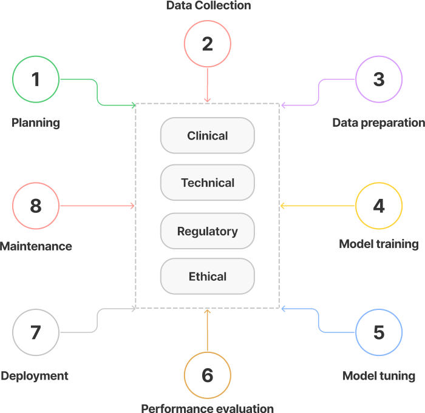

# How to participate in Benchmarks?
To be able to participate in our benchmarks you need to follow the following steps:

1. Register to the platform and login.
2. View all benchmarks [here](https://health.aiaudit.org/web/challenges/list) and select the one you want to participate in.
3. Go to the sub-page called "Participate".
4. Create a team. This enables you to work with other people on a submission.
5. Accept the terms and conditions and participate in the selected challenge.

After these general steps, the participation steps differ, depending on if the benchmark is
prediction-based or code-upload-based. Individual challenges also might have different conditions,
so it is advised to follow the instructions on the participation page itself.

To understand the general difference between the benchmark types, please view the section [Types of Benchmarks](_types.md).

## Prediction-based Benchmarks
Once you have your trained model, perform the following steps:

1. Fill out the questionnaire on the sub-pages *Questionnaire* and *Q/A Assessment*.
2. Run your trained model against the test data made available by the benchmark owners.
3. Upload your model's predictions through the platform under *Submit*. Which file type is required will be specific.
4. You will be able to view your submission status under *My Submissions*.
5. Once your submission has finished and you filled out the questionnaire, you can download your model report sheet under *My Report*.

## Code-upload-based Benchmarks
To upload your model you need to have the [EvalAI-CLI](_participate?id=install-the-evalai-cli)  installed. Once you have your trained model, perform the following steps:

1. Fill out the questionnaire on the sub-pages *Questionnaire* and *Q/A Assessment*.
2. Dockerize your trained model. A detailed description of these steps will follow.
3. Login to the EvalAI-CLI ```evalai login ```
4. View all challenges  ```evalai challenges```
5. Ensure you have signed up to participate through the platform already.
6. Push your Docker image to the challenge with phase id ```evalai push <image:tag> -p PHASE_ID```. The phase ID also contains the benchmark ID. It can be found under the *Submit* page of the benchmark, alongside additional instructions.
7. You will be able to view your submission status under *My Submissions*.
8. Once your submission has finished and you filled out the questionnaire, you can download your model report sheet under *My Report*.

## Install the EvalAI-CLI
[EvalAI-CLI](https://github.com/Cloud-CV/evalai-cli) is a command-line tool needed to be able to upload Docker images and participate in code-upload-based challenges. You can also use the client to upload your predictions and view current challenges, but it is recommended to use our user interface on the platform.

To install the client follow these steps:

1. Make sure you have installed python and pip.
2. ```pip install evalai```
3. ```evalai set-host http://health.aiaudit.org:8000 ```
4. To test if the installation worked, try and log in with your credentials using: ```evalai login ```

An additional resource is the documentation for the [client](https://cli.eval.ai/).

## Fill out the questionnaire
The adherence to clinical and regulatory standards is realized through an extensive, qualitative questionnaire containing over 69 questions. The audit creator can configure the questionnaire parameters within the configuration file and control the set of questions that will be visible on the platform. This questionnaire is intended for the researchers to specify important information about the lifecycle requirements of the particular ML4H use case under consideration covering that AI/ML technology, Clinical, Regulatory and Ethical Requirements. Later, the auditor team can give their expert review feedback on the questionnaire results submitted by the audit participants on the questionnaire assessment sheet. Based on the questionnaire and evaluation results, the auditor team can finally generate the extensive model report sheet.



## Dockerize a model
To be continued ...
