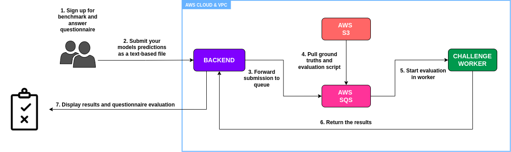
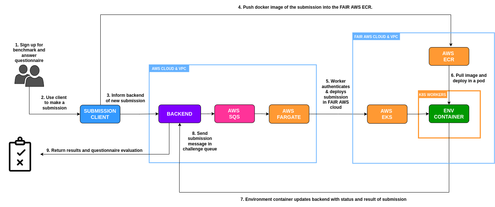

# Our types of benchmarks
The main goal of our platform is to provide a flexible and reliable environment to test machine learning algorithms in health. We offer two types of benchmark pipelines, one by solely assessing the uploaded predictions of a model by comparison with private true labels and the other by testing the model itself against private test data. A variety of metrics are used to measure the performance for both, yet the underlying pipelines and requirements differ. In the following section, the types of benchmarks will be explained and advice is given for when to use which. The explanations are from the perspective of a benchmark host. For explanations on how to participate, please view the respective section [Participate in Benchmarks](_participate.md).

## 1. Prediction-based benchmarks (text-based)
The core idea behind prediction-based benchmarks is that the evaluation is based on the predictions of the model only. This means that hat the participant needs access to testing data for their model, manually test it and only upload the results to the platform. The predictions are then compared to the ground truths of the dataset, previously uploaded by the benchmark owner. These results will be analyzed and reviewed by the audit team, compared with the ground truths, and the general performance of the model evaluation. Additionally, the submission will be evaluated based on a qualitative questionnaire submitted in advance of the evaluation. Both the questionnaire and evaluation results will be viewed by our auditor team to generate an extensive model report sheet.

### 1.1 Benchmark Pipeline

### 1.2 Requirements
  1. An evaluation script, defining the specific metrics for testing.
  2. Test data you will provide. It needs to be publicly available for participants to test themselves.
  3. The annotated ground truths.

### 1.3 When should it be used?
Prediction-based upload challenges are recommended if:
  - The test dataset can be made public.
  - The creation and built of the benchmark should be simple.
  - Desired evaluation metrics only rely on the comparison of ground truths and predictions.

## 2. Code-upload-based benchmarks (Docker)
For code-upload-based benchmarks, a participant first needs to dockerize their trained model and upload it through the EvalAI-CLI to [our platform](https://health.aiaudit.org/). The model is then securely stored in our cloud environment. The testing environment is separate from the platform, to guarantee the isolation of the evaluation. The participant's docker image, the test data and the evaluation code are deployed in this separate environment and testing occurs. Afterward, the results are forwarded to the platform, where they can be viewed. Additionally, the submission will be evaluated based on a qualitative questionnaire submitted in advance of the evaluation. Both the questionnaire and evaluation results will be viewed by our auditor to generate an extensive model report sheet.

### 2.1 Benchmark Pipeline

### 2.2 Requirements
  1. An evaluation script, defining the specific metrics for testing.
  2. Test data you will provide. It will not be available to the public.
  3. The annotated ground truths.
  4. An environment container, defining the communication between submitted model and test data. Requires knowledge of Docker and networking.

### 2.3 When should it be used?
Prediction-based upload challenges are recommended if:
  - The test dataset cannot be made public.
  - The model's evaluation process can/must be isolated.
